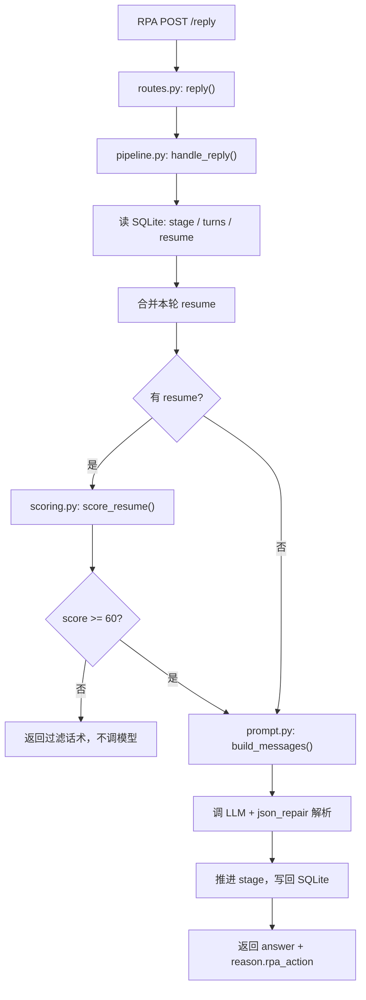

from rpa.rpa_main import resume_person

# Boss直聘自动招聘沟通机器人

RPA 做"手脚"(网页读取/输入/点击), Python 做"大脑"(拼 prompt / 调大模型 / 解析决策 / 维护会话状态)。

```
RPA 抓未读消息+对话+简历  ──HTTP POST /reply──▶  Python 服务  ──▶  大模型
RPA 发送回复 / 发地址  ◀──JSON──  (answer + rpa_action)
```

## 快速开始

```bash
pip install -r requirements.txt
cp .env.example .env      # 生产默认 LLM_PROVIDER=aliyun，填 API key
python run.py             # 启动在 http://127.0.0.1:8000
```

打开 http://127.0.0.1:8000/docs 可看交互式接口文档。

## `/reply` 工作流



## 接口

### POST /reply  (RPA 主接口)

请求体:

```json
{
  "candidate_id": "boss_user_12345",
  "conversation": "RPA 抓取的当前窗口全部可见对话文本",
  "resume": "",
  "job_id": "ecommerce_ops_suzhou",
  "job_requirement": "",
  "company_info": "",
  "trigger": "auto",
  "last_message_from": "candidate"
}
```

> `job_id` 从 [jobs.yaml](jobs.yaml) 加载 JD/公司信息；也可继续直接传 `job_requirement` / `company_info`。  
> `stage` 不由 RPA 传，由 Python 按 `candidate_id` 从 SQLite 读取/维护。

响应体:

```json
{
  "answer": "回复文本",
  "need_resume_ocr": false,
  "reason": {
    "rpa_action": "skip | request_resume | reply_message | send_company_address",
    "basis": "依据说明",
    "next_stage": "了解动机"
  }
}
```

RPA 按 `reason.rpa_action` 分支：

| rpa_action | 影刀动作 |
|------------|----------|
| `skip` | 不操作，下一候选人 |
| `request_resume` | 可选发送 `answer`，点击「求简历」 |
| `reply_message` | 键盘输入 `answer` |
| `send_company_address` | 执行发地址预设 |

`need_resume_ocr=true` 且 `resume` 为空时，影刀才执行「点附件简历 → OCR → 带 `trigger=after_resume_ocr` 再调 `/reply`」。

有 `resume` 时，评分与回复合并为 **一次 LLM 调用**；相同简历不重复评分（SQLite 缓存 `resume_score`）。对话指纹相同则 `skip`，避免重复回复。

### POST /reset  (调试用)

```json
{ "candidate_id": "boss_user_12345" }
```

清除该候选人会话状态, 联调时重来用。

## 影刀集成

完整的逐节点改造清单（对照旧流程）与 Python/JS 参考代码见 [rpa/RPA.md](rpa/RPA.md)：

- [rpa/extract_candidates.js](rpa/extract_candidates.js) — 循环外一次抓取候选人列表
- [rpa/extract_chat.js](rpa/extract_chat.js) — 循环内一次 JS 抓取对话与元数据
- [rpa/rpa_main.py](rpa/rpa_main.py) — 统一单循环 `/reply` 调用（接口异常自动降级 skip）
- [rpa/rpa_after_ocr.py](rpa/rpa_after_ocr.py) — OCR 完成后二次调用

## 影刀 Python 请求示例

```python
import requests
candidate_id = ""
all_chat_text = ""
resume_person =  ""
current_job_id = ""
last_message_from = "candidate"
payload = {
    "candidate_id": candidate_id,
    "conversation": all_chat_text,
    "resume": resume_person or "",
    "job_id": current_job_id,
    "trigger": "auto",
    "last_message_from": last_message_from,
}

result = requests.post("http://127.0.0.1:8000/reply", json=payload, timeout=30).json()
rpa_action = result["reason"]["rpa_action"]
need_resume_ocr = result.get("need_resume_ocr", False)
content = result.get("answer", "")
```

## 验证

```bash
pytest tests/
```

## 模型配置

生产环境 `.env`:

```
LLM_PROVIDER=aliyun
LLM_API_KEY=你的 API Key
LLM_MODEL=qwen3-vl-plus
LLM_BASE_URL=https://dashscope.aliyuncs.com/compatible-mode/v1
```

DeepSeek 等 OpenAI 兼容模型只需改 `LLM_BASE_URL` 和 `LLM_MODEL`。`LLM_PROVIDER=tongyi` 是 `aliyun` 的别名。

测试时使用 `LLM_PROVIDER=mock`（pytest 已自动设置），无需 API key。

## 目录

```
app/
├── main.py            FastAPI 入口
├── config.py          配置 (.env)
├── schemas.py         请求/响应模型 + RPA 动作枚举
├── api/routes.py      /reply, /reset
├── core/
│   ├── prompt.py      系统提示词 + 合并评分回复
│   ├── fast_path.py   skip/request_resume 前置规则
│   ├── jobs.py        job_id 配置 lookup
│   ├── scoring.py     简历评分
│   ├── json_repair.py 模型 JSON 容错解析
│   └── pipeline.py    主编排
├── rpa/               影刀参考脚本与改造指南
├── jobs.yaml          岗位 JD/公司配置
├── llm/
│   ├── base.py        provider 抽象 + 工厂
│   ├── mock.py        测试专用假数据
│   └── aliyun.py      生产 LLM provider
└── store/db.py        SQLite 会话状态
```
